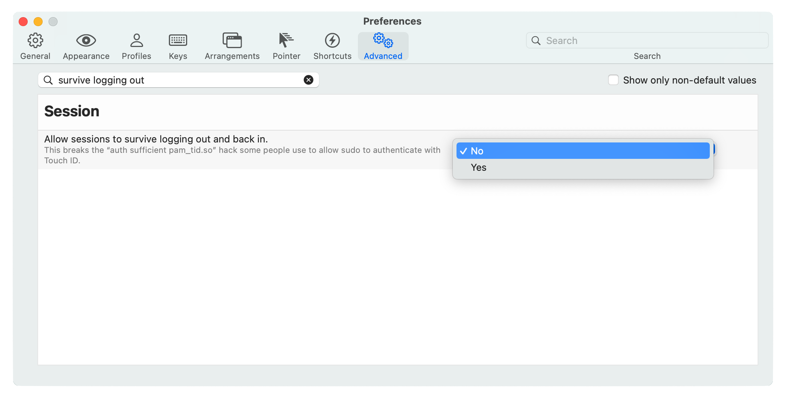

# sudo-via-touch-id

TL;DR: A shell script to allow you to use Touch ID on a Mac with `sudo`.

## Our Hero's Origin Story

Cabel Sasser of Panic [tweeted](https://twitter.com/cabel/status/931292107372838912):

<blockquote class="twitter-tweet">
Pro MacBook Pro Tip: have a Touch Bar with Touch ID? If you edit /etc/pam.d/sudo and add the following line to the top…  auth sufficient pam_tid.so  …you can now use your fingerprint to sudo!
&mdash; Cabel (@cabel) <a href="https://twitter.com/cabel/status/931292107372838912?ref_src=twsrc%5Etfw">November 16, 2017</a></blockquote>

Which is awesome if you have a Mac with Touch ID, or one of the new [Magic Keyboard with Touch ID for Mac models with Apple silicon](https://www.apple.com/shop/product/MK293LL/A/magic-keyboard-with-touch-id-for-mac-models-with-apple-silicon-us-english) (including the new M1-based iMac).

***However*** what is _not_ awesome is that each update to macOS (as in “11.5.0” and “11.5.1”, etc) will remove this customization (and some others) so I was continually having to re-add it, which meant googling for this tweet, finding the right file, making the change, etc.

Obviously this demands to be automated! So I wrote a shell script.

Look, I'll be honest, it's not the most robust thing in the world. Here's what it does (the script itself is also thoroughly commented).

1. Checks the file `/etc/pam.d/sudo` to see if the line is in there already
2. If yes, don't add it again (because duh)
3. If no, add it to the file by:
	- creating a temp file,
	- adding the line to the temp file
	- adding the rest of the original file to the temp file
	- setting the correct permissions of the temp file
	- setting the correct ownership of the temp file
	- replace the original file with the temp file (which requires `sudo` because… well, you’d hope so, right?)

If you have done some extensive customization of your `/etc/pam.d/sudo` file, you might want to double-check this doesn't break it.

If you use the default `/etc/pam.d/sudo` this _should_ work fine (but see disclaimer below).

## iTerm

If you use [iTerm2](https://iterm2.com/), you should know that one of its defaults is incompatible with this setting.

The setting is called “Allow sessions to survive logging out and back in” and defaults to “Yes” but needs to be set to “No” as shown here:

To find this setting, go to iTerm’s Preferences, then click on “Advanced” and scroll down to “Session” or search for “survive logging out” (as I’ve done in the image above).

Note that iTerm's developer even notes in the comment about this setting:

> This breaks the “auth sufficient pam_tid.so” hack some people use to allow sudo to authenticate with Touch ID.

I wouldn’t call it a ‘hack’ but you get the gist.

The script will also check to see if iTerm is installed either at `/Applications/iTerm.app` or  `$HOME/Applications/iTerm.app`.

If no, the script will exit.

If yes, the script will check to see if this has been set properly.

It does this by running

`defaults read com.googlecode.iterm2 BootstrapDaemon`

and if it gets the answer `0` (zero) then it considers it set properly. If it is unset or otherwise not-zero, then it will tell the user to change it.

***This script does not automatically change iTerm’s settings*** because I consider that up to the user to decide. Plus, if you are using iTerm when you run this script, changing the setting via `defafults write` might not even work properly. So it's best to change it via the Preferences window, IMO.

## No Warranty or Guarantee or Anything Like It.

This works for me and has never deleted my important files or posted illicit pictures to the Internet, but if that happens to you, all you will get from me is an apology. (Plus a “What? How?”)

----

The short URL for this page is: <https://luo.ma/sudo-touch-id>.

